# Multi-Modem "Make-Before-Break" IP Rotation

## 1. The idea

A single cellular modem cannot rotate its public IP without going dark: a band-hop +
`DISCONNECT_NETWORK`/`CONNECT_NETWORK` cycle drops the bearer for seconds to tens of
seconds. Every rotation is a connectivity gap.

With **two modems** (here: one **K12/ZX297520** and one **MF920U**) we turn that gap
into zero downtime by **making the new path before breaking the old one**:

> At all times exactly one modem is **ACTIVE** and carries host traffic. The other is
> **STANDBY**. We rotate the STANDBY (it may go dark — nobody is using it), wait until it
> has a *solid* connection with a fresh IP, then flip the ACTIVE role to it. Now the old
> ACTIVE is free to rotate. Ping-pong forever.

Result: continuous uplink **and** a public IP that changes on every swap. The rotation
cadence is `rotate_time + dwell_time`, and the connectivity gap is ~0.

## 2. Topology and prerequisites

```
         ┌────────────── Windows / macOS / Linux host ──────────────┐
         │                                                           │
  Internet ⇄ [K12]  ── RNDIS/ENet ──► iface A  192.168.0.1  (gw)     │
         │                                                           │
  Internet ⇄ [MF920U] ─ USB RNDIS ──► iface B  192.168.8.1  (gw)     │
         │                                                           │
         │   Orchestrator picks which iface holds the default route  │
         └───────────────────────────────────────────────────────────┘
```

Hard requirements (learned the hard way):

- **Distinct LAN subnets per modem.** Both ZTE families default to `192.168.0.1`. If two
  gateways share `192.168.0.0/24` on two interfaces, host routing to `192.168.0.1` is
  ambiguous and control traffic reaches the wrong device. We already moved the MF920U to
  `192.168.8.1/24` for exactly this reason; the K12 stays on `192.168.0.1/24` (or its own).
  This is a **precondition**, not an optimization — see `DHCP_SETTING` in
  [goform_api_reference.md](goform_api_reference.md).
- **One SIM (+ coverage) per modem.** Each uplink needs its own attached bearer; a modem
  in `LIMITED_SERVICE`/`NO_SERVICE` can never be promoted to ACTIVE.
- **Per-modem source binding.** Control-plane requests to each modem must egress its own
  interface (`--bind-ip <host addr on that modem's subnet>`), so managing modem A never
  leaks through modem B.

## 3. Per-modem driver abstraction (already in place)

The two modems authenticate differently; the tool already adapts (`is_k12_firmware()`):

| Concern            | K12 / ZX297520                                  | MF920U (UFI family)                                        |
| ------------------ | ----------------------------------------------- | ---------------------------------------------------------- |
| Login              | `sha256(sha256(pw)+LD)`, LD challenge           | `Base64(pw)`, no challenge                                 |
| AD (Request token) | `sha256(sha256(wa_inner_version)+RD)`           | `md5(md5(wa_inner_version+cr_version)+RD)`                 |
| Session            | cookie (well-formed)                            | malformed `stok` cookie — captured & replayed manually     |
| Session lifetime   | cookie                                          | **also keyed by client IP**; `ensure_logged_in` must hold the cookie, not trust `loginfo` |
| Band lock          | `BAND_SELECT` / `LOCK_FREQUENCY`                | `BAND_SELECT` (backend-supported though not in its WebUI)  |
| Bearer cycle       | `DISCONNECT_NETWORK` / `CONNECT_NETWORK`        | same                                                       |

So the fleet layer just holds **one `ZTEClient` per modem**, each with its own
`host`, `password`, and `bind_ip`. All firmware differences are below that line.

## 4. The rotation state machine

```mermaid
stateDiagram-v2
    [*] --> Init
    Init --> Steady: both modems verified solid, pick one ACTIVE
    Steady --> RotateStandby: dwell timer elapsed
    RotateStandby --> WaitSolid: band-hop + reconnect the STANDBY
    WaitSolid --> RotateStandby: standby failed to reacquire (retry, keep ACTIVE serving)
    WaitSolid --> Swap: standby is SOLID (bearer up, fresh IP, probe OK)
    Swap --> Steady: flip default route to ex-standby; roles exchange
    Steady --> Degraded: ACTIVE lost its bearer
    Degraded --> Swap: other modem is solid -> emergency swap
    Degraded --> Degraded: neither solid -> hold, alarm, retry
```



Invariants the orchestrator must never violate:

1. **Never rotate the ACTIVE modem.** Only the STANDBY rotates.
2. **Never swap TO a modem that isn't solid.** (definition below)
3. **At most one modem rotating at a time.** Rotating both = total blackout.
4. **On any ACTIVE bearer loss, prefer an emergency swap** to a solid standby over waiting.

## 5. "Solid connection" gate

A modem may be promoted to ACTIVE only when **all** hold, checked over its own interface:

- `modem_main_state == modem_init_complete`
- `ppp_status == ppp_connected` **and** `wan_ipaddr` is a routable address
- signal above a floor (e.g. `lte_rsrp > -110 dBm`) — avoids promoting a doomed link
- **active reachability probe**: a small HTTP/DNS request *source-bound to that modem's
  host IP* actually completes (e.g. `GET http://204.204... ` / a 204 endpoint). This is the
  only check that proves real end-to-end internet, not just a local bearer.

The probe must be source-bound (`local_address`) so it is answered *through that modem*,
not the current ACTIVE path.

## 6. Traffic swap mechanism

The swap is a **default-route change**, not a per-flow move. Give each modem's interface a
default route; the ACTIVE one gets the lowest metric.

| OS       | Make modem's iface ACTIVE (lowest metric)                                  |
| -------- | -------------------------------------------------------------------------- |
| Windows  | `Set-NetIPInterface -InterfaceIndex <idx> -InterfaceMetric <low/high>`     |
| Linux    | `ip route replace default via <gw> dev <if> metric <n>`                    |
| macOS    | `route change default <gw>` (or `networksetup -setnetworkserviceorder`)    |

- Only the ACTIVE modem holds a low metric; the STANDBY/rotating one gets a very high
  metric (or its default route withdrawn) so nothing egresses through it while it is dark.
- Existing TCP flows **break at the swap** (the public IP changes). For rotation/region-hop
  workloads (scraping, IP churn) that is the desired behavior; for long-lived sessions it is
  a known limitation (see §8).

Advanced option (not the default): keep both default routes and use **policy/source
routing** to pin specific flows per modem (true dual-uplink load-balance). More complex; the
user's stated model is failover-swap, so metric-swap is the right primitive.

## 7. Proposed implementation in `zte-control`

A new subcommand driving N `ZTEClient`s from a small config:

```jsonc
// fleet.json
{
  "dwell_seconds": 90,          // how long an ACTIVE modem serves before we rotate its peer
  "probe_url": "http://<204-endpoint>",
  "modems": [
    { "name": "k12",    "host": "http://192.168.0.1", "password": "…",
      "bind_ip": "192.168.0.100", "iface_index": 21 },
    { "name": "mf920u", "host": "http://192.168.8.1", "password": "…",
      "bind_ip": "192.168.8.178", "iface_index": 44 }
  ]
}
```

```
zte-control fleet-rotate --config fleet.json
```

Orchestrator loop (pseudocode):

```
solidify(all)                       # bring both up, verify
active = pick_solid(modems)
set_metric(active, LOW); others -> HIGH
loop:
    standby = the non-active modem
    rotate(standby)                 # existing band-hop + DISCONNECT/CONNECT primitive
    if wait_until_solid(standby, timeout):
        set_metric(standby, LOW)    # make-before-break: new path is already up
        set_metric(active,  HIGH)
        active = standby            # roles exchange
    else:
        log("standby failed to reacquire; keeping current active")
    sleep(dwell_seconds)
    # opportunistic: if active's bearer drops mid-dwell, emergency-swap if peer is solid
```

Reuses everything already built: adaptive auth, cookie handling, `reconnect`/`lock-band`,
`--bind-ip`. The genuinely new code is (a) the OS routing-metric abstraction, (b) the
source-bound health probe, and (c) the role/state machine above.

## 8. Limits and honest caveats

- **Swaps break in-flight connections.** Fine for IP rotation; disruptive for streaming or
  long downloads. A "drain" mode (wait for the ACTIVE modem's connection count to fall
  before swapping) can soften this but cannot eliminate it — the IP changes.
- **Needs 2 SIMs in coverage.** Both modems must be able to attach; otherwise this degrades
  to single-modem with gaps.
- **Admin/routing privileges.** Changing interface metrics/default routes needs elevation on
  all three OSes.
- **Band lock ≠ IP change guarantee.** A new IP comes from the bearer re-establishment
  (`DISCONNECT`/`CONNECT`), which the carrier may or may not re-address; band-hopping just
  encourages a different cell/region. Verify the new `wan_ipaddr` differs before counting a
  rotation as "region-changed".
- **MF920U band lock** is backend-supported but absent from its WebUI, so it is effectively
  undocumented on that unit — treat as best-effort and always verify via `wan_active_band`.

See also: [zte_k12_platform_architecture.md](zte_k12_platform_architecture.md),
[goform_api_reference.md](goform_api_reference.md).
