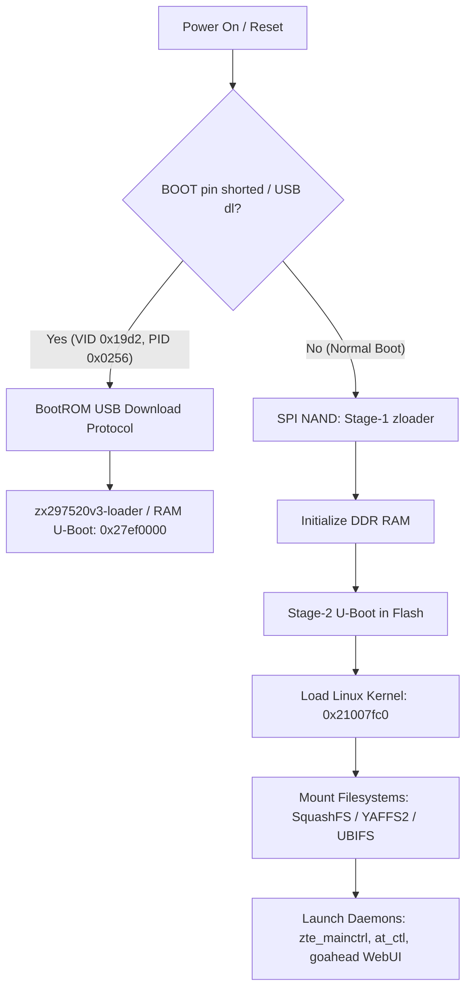

# ZTE K12 (ZX297520V3 / ZX297520V3E) Platform Architecture Reference

## 1. Executive Summary

The **ZTE K12** (and related carrier-branded variants such as Vodafone K12) is built upon the **Sanechips (ZXIC / ZTE Microelectronics) ZX297520V3 / ZX297520V3E** platform. This chipset integrates an ARM application processor, a dedicated Cortex-M preloader subsystem, and a multi-mode LTE Cat4 baseband DSP into a single system-on-chip (SoC).

The router architecture utilizes an internal IPC layer (`zte_mainctrl`, `at_ctl`) bridging the web management daemon (GoAhead) and the cellular baseband DSP. This architecture powers key operational features:
* **Cell Locking** (LTE EARFCN + PCI / Cell-ID fixation)
* **Band Locking & Frequency Selection**
* **Carrier Re-selection & RF Reset Automation**
* **Real-time Signal & Telemetry Monitoring**

---

## 2. Hardware & Chipset Architecture

### 2.1 Core Subsystems
| Subsystem | Architecture / Core | Purpose | Notes |
| :--- | :--- | :--- | :--- |
| **AP (Application Processor)** | ARM Cortex-A53 (ARMv8 / AArch32 mode) | Runs Linux kernel, Busybox, GoAhead Web Server, routing daemons | Memory base typically `0x21007fc0` / `0x27ef0000` |
| **Boot MCU (Preloader)** | ARM Cortex-M0 / M-series | Inits DRAM controller, checks boot straps / USB download mode, kicks AP | Runs `zloader` (Flash) or `tloader` (USB) |
| **Baseband DSP & Modem Subsystem** | Proprietary ZTE Baseband Core | Handles LTE PHY/MAC, RF transceiver control, AT command parser | Controlled via internal IPC (`zte_mainctrl`, `at_ctl`) |
| **Flash Memory** | SPI NAND Flash (typically 128MB / 1Gb, e.g., WSON8 Dosilicon DS35M1GA / Winbond W25N01GW) | Stores bootloaders, kernels, rootfs, NVRAM, user data | Page size: 2048B + 64B/128B OOB |
| **DRAM** | 64MB / 128MB DDR2/DDR3 | System RAM | Initialized by Stage-1 loader |

### 2.2 USB Identifiers & Mode-Switching
The device supports several USB descriptor configurations governed by USB mode switching (handled by USB descriptors or WebUI commands):

| Mode | Vendor ID (VID) | Product ID (PID) | Interfaces & Endpoints | Purpose |
| :--- | :--- | :--- | :--- | :--- |
| **Initial / CD-ROM Mode** | `0x19d2` | `0x0016` / `0x1405` | Mass Storage (CD-ROM emulation / `DEMOMODEM`) | Presents PC driver installer & autorun |
| **Normal Router Mode** | `0x19d2` | `0x1405` / `0x1403` | USB NCM / CDC-ECM Ethernet (`enX`), Mass Storage | Default router operating mode |
| **Debug / Factory Mode** | `0x19d2` | `0x0500` / `0x1405` | NCM + Diag Serial (`/dev/ttyUSB0`) + AT Serial (`/dev/ttyUSB1`) | Diagnostic and AT serial interface |
| **USB Download (BootROM)** | `0x19d2` | `0x0256` | Single Bulk IN/OUT endpoint pair | Low-level ROM recovery & loader mode |

---

## 3. Boot Sequence & Memory Layout



### 3.1 Partition Layout (SPI NAND)
Extracted from ZX297520V3 / ZLT S10 flash structures:

| Partition Name | Typical Size / Offset | File System / Type | Content Description |
| :--- | :--- | :--- | :--- |
| `zloader` | `0x00000000` (First blocks) | Raw Binary | Cortex-M0 DRAM init preloader |
| `uboot` | Follows zloader | Raw Binary | Main U-Boot stage-2 bootloader |
| `uboot-mirr` | Mirror block | Raw Binary | Redundant backup copy of U-Boot |
| `nvrofs` | Read-only partition | Read-Only FS / Binary | Factory calibration, default IMEI (`0x0`), MAC (`0x7C`, `0x2C0`), RF tables |
| `imagefs` | Kernel image | Raw / FIT / uImage | Linux kernel (`zImage`) and AP baseband firmware |
| `rootfs` | Primary system | SquashFS / CramFS | Core Linux userspace binaries, busybox, web server |
| `yaffs` / `userdata` | Writable storage | YAFFS2 / JFFS2 / UBIFS | Dynamic configs (`/yaffs/apply_config.conf`, `/etc_rw/nv/`) |

---

## 4. Modem Inter-Process Communication (IPC) & RF Control

In ZTE ZX297520 platforms, the web server (GoAhead) does not talk directly to the modem hardware. Instead, requests flow through an internal IPC message bus:

```
[Web Client / Script]
         │
         ▼  HTTP POST /goform/goform_set_cmd_process
[GoAhead Web Server]
         │
         ▼  Internal IPC Message (e.g. 0x1527, 0x100b)
[zte_mainctrl / at_ctl]
         │
         ▼  AT Commands (e.g. AT+ZLTELC, AT+ZBAND)
[Baseband DSP / Cellular Firmware]
```

### 4.1 Key IPC Handlers Identified in `goform`
* **`0x1527` (Cell Locking / `GOFORM_LOCK_FREQUENCY`)**: Converts `actionlte`, `uarfcnlte` (EARFCN), and `callParaIdlte` (PCI) parameters into `AT+ZLTELC` commands sent to the modem baseband.
* **`0x100b` (MAC / IMEI Configuration)**: Hits `MSG_CMD_WEB_MAC_REQ` / IMEI updater routines.
* **`0x101a` (Time / Management Control)**: Triggers internal management routines in `zte_mainctrl`.
* **`0x1542` (Network Unlock)**: Processes network configuration and PLMN settings.
* **`0x159a` / `0x159c` (Network Connect / Disconnect)**: Connects and disconnects LTE data bearers (useful for clean RF renegotiation and IP re-assignment).

---

## 5. Automation & Integration Overview

1. **Step 1: WebUI & GoForm Interface**
   - Query device identity (`wa_inner_version`, `cr_version`, `hardware_version`, `modem_msn`).
   - Use `goform` APIs for status queries and cellular metrics.

2. **Step 2: Automated Control & Cell Locking**
   - Issue `LOCK_FREQUENCY` / `AT+ZLTELC` commands for dynamic band and cell locking.
   - Use `DISCONNECT_NETWORK` and `CONNECT_NETWORK` to trigger cellular reconnection and IP rotation.
